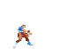
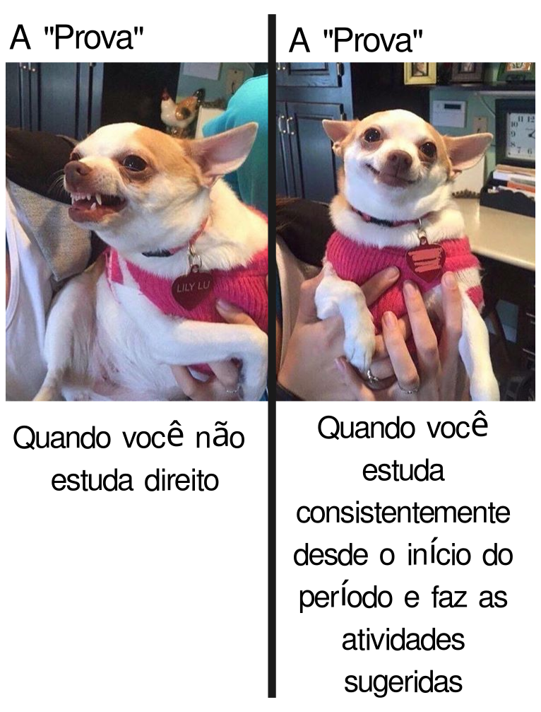

# Curso Introdutório de Programação em C++

Bem-vindo ao curso introdutório de programação em C++! Neste curso, você aprenderá os conceitos fundamentais da linguagem C++ e estará pronto para desenvolver seus próprios programas.

  
Como não passar nesta matéria

  # Como não passar nesta matéria

  Olá, queridos alunos! Vamos falar sobre como ter sucesso neste curso? Não? Ah, você quer saber como não passar?
  Aqui vai um guia infalível para garantir que você não passe nesta matéria. Siga estas dicas e o insucesso será seu fiel companheiro!

  ## 1. Estude só na véspera da prova - o segredo do fracasso!

  Lembre-se: a universidade é igualzinha ao ensino médio! Aquelas matérias complexas e extensas? Pfff, besteira! Você consegue absorver todo esse conteúdo em uma única noite de estudos intensos. Afinal, quem precisa de tempo para processar informações, não é mesmo?

  Ignore completamente o fato de que o cérebro precisa de tempo para consolidar memórias e criar conexões entre conceitos. A neurociência? Ora, isso é só um modismo passageiro!

  ## 2. Sono é para os fracos!

  Dormir é perda de tempo. Quem precisa de sono quando se tem café e energéticos? Esqueça tudo o que ouviu sobre a importância do sono para a consolidação da memória e para o bom funcionamento cognitivo. 

  Afinal, o que os neurocientistas sabem? Eles só estudam o cérebro há décadas. Você, com sua sagacidade de última hora, certamente sabe mais do que eles.

  ## 3. Consistência? Que bobagem!

  Estudar um pouquinho todos os dias? Que ideia mais absurda! É muito melhor acumular todo o conteúdo para uma maratona de estudos na véspera da prova. Seu cérebro vai adorar essa sobrecarga de informações de última hora.

  Ignore completamente as pesquisas que mostram que o aprendizado espaçado é mais eficaz. Afinal, o que é a ciência cognitiva comparada à sua intuição infalível?

  ## Conclusão

  Seguindo essas dicas, você estará no caminho certo para não passar nesta matéria. Mas hey, se por algum motivo você decidir fazer o oposto do que foi sugerido aqui - estudar consistentemente, dormir bem e respeitar os processos de aprendizagem do seu cérebro - bem, aí a responsabilidade é toda sua se acabar passando com louvor!

## Conteúdo do Curso

1. **[Introdução ao C++](https://oangelo.github.io/Introducao-a-Programacao)**:
   - História e evolução da linguagem
   - Características e aplicações do C++
   - Ambiente de desenvolvimento (IDE, compiladores)

2. **[Estrutura Básica do Programa C++](https://oangelo.github.io/Introducao-a-Programacao/introducao_cpp.html)**:
   - Função `main()` e ponto de entrada do programa
   - Diretivas de pré-processador (`#include`, `#define`)
   - Comentários

3. **[Tipos de Dados e Variáveis](https://oangelo.github.io/Introducao-a-Programacao/introducao_cpp.html)**:
   - Tipos de dados primitivos (int, float, double, char, bool)
   - Declaração e inicialização de variáveis
   - Operadores aritméticos, de atribuição e lógicos

4. **[Entrada e Saída de Dados](https://oangelo.github.io/Introducao-a-Programacao/introducao_cpp.html)**:
   - Uso das funções `cout` e `cin` para entrada e saída
   - Formatação de saída (manipuladores)
   - [Exercícios 1](exercicios/introducao_cpp.md)
   - [Exercícios 2](exercicios/introducao_cpp_2.md)

5. **[Estruturas de Controle](https://oangelo.github.io/Introducao-a-Programacao/estruturas-de-controle.html)**:
   - Declarações `if-else` e operador ternário
   - Loops `for`, `while` e `do-while`
   - Instruções de desvio (`break`, `continue`)
   - [Exercícios 1](exercicios/estruturas-de-controle.md)

6. **[Funções](https://oangelo.github.io/Introducao-a-Programacao/funcoes.html)**:
   - Definição e chamada de funções
   - Passagem de parâmetros (por valor e por referência)
   - Escopo de variáveis e funções
   - [Exercícios 1](exercicios/cpp-functions-exercises.md)

7. **[Arrays](https://oangelo.github.io/Introducao-a-Programacao/arrays.html)**:
   - Declaração e manipulação de arrays
   - Acesso a elementos de um array
   - Processamento e iteração sobre arrays
   - [Exercícios 1](exercicios/arrays.md)

### Exercícios de preparação para o primeiro chefe de fase  
   - [Exercícios 1](exercicios/condicionais_loops_fucoes_arrays.md)
   - [Exercícios 2](exercicios/condicionais_loops_fucoes_arrays2.md)
   - [P1 - 2024](https://oangelo.github.io/Introducao-a-Programacao/provas/2024/P1.html)

8. **[Arrays Multidimensionais e Matrizes](https://oangelo.github.io/Introducao-a-Programacao/matriz.html)**:
   - Declaração e inicialização de arrays 2D e 3D
   - Acesso e manipulação de elementos em arrays multidimensionais
   - Aplicações práticas de matrizes
   - [Exercícios](exercicios/matrizes.md)

9. **[Ponteiros](https://oangelo.github.io/Introducao-a-Programacao/ponteiros.html)**:
   - Sistema Hexadecimal
   - Operadores * e &
   - Declaração e uso de ponteiros
   - Ilustração da memória do computador
   - Aritmética de ponteiros
   - Passagem de parâmetros por referência
   - Ponteiros para ponteiros
   - [Exercícios](exercicios/ponteiros.md)

10. **[Alocação Dinâmica de Memória](https://oangelo.github.io/Introducao-a-Programacao/memoria.html)**:
    - Uso das funções `new` e `delete` para alocar e liberar memória
    - Alocação de arrays dinamicamente
    - Desafios e boas práticas na alocação dinâmica
    - [Exercícios](exercicios/memoria.md)

### Exercícios de preparação para o segundo chefe de fase  
   - [Exercícios 1](exercicios/exercicios_prep_mat_pont_mem.md)
   - [Desafios](exercicios/desafios_p2.md)

11. **[Estruturas (struct)](https://oangelo.github.io/Introducao-a-Programacao/estruturas.html)**:
    - Definição e uso de estruturas
    - Aninhamento de estruturas
    - Arrays de estruturas
    - [Exercícios](exercicios/estruturas.md)

12. **[Ponteiros para Funções](https://oangelo.github.io/Introducao-a-Programacao/ponteiros_funcoes.html)**:
    - O que são ponteiros para funções
    - Sintaxe e declaração
    - Callbacks
    - Padrões de design básicos
    - Exemplos práticos
    - Casos de uso comuns
    - [Exercícios](exercicios/ponteiros_funcoes.md)

13. **[Manipulação de Arquivos](https://oangelo.github.io/Introducao-a-Programacao/arquivos.html)**:
    - Abertura e fechamento de arquivos
    - Leitura e escrita em arquivos de texto
    - Manipulação de arquivos binários
    - [Exercícios](exercicios/arquivos.md)

### Exercícios de preparação para o Gran Finale 
    - [Exercícios](exercicios/gran_finale_1.md)
    - [Exercícios](exercicios/gran_finale_2.md)

Ao final deste curso, você terá uma sólida compreensão dos conceitos fundamentais da linguagem C++ e estará pronto para começar a desenvolver seus próprios programas.

  
Calendário de Provas

  <ul>
    <li>P2: 04/11/09</li>
    <li>P3: 02/12/24</li>
    <li>PS: 09/12/24 (Prova para quem faltou alguma prova ou gostaria de substituir alguma nota por esta)</li>
    <li>PF: 16/12/24</li>
  </ul>
  

Bons estudos!
